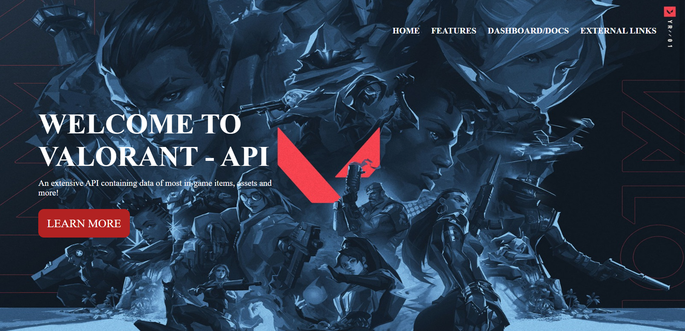
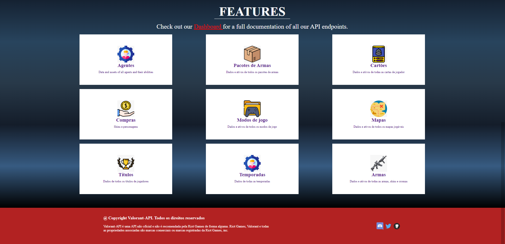

# 

 Seja Bem vindo ao projeto valorantApi! 

### Tópicos

- [Descrição do projeto](#descrição-do-projeto)
- [Funcionalidades](#funcionalidades)
- [Como funciona?](#como-funciona)
- [Limitações:](#limitações)
- [Aplicação Desktop](#aplicação-desktop)
- [Aplicação Responsiva](#aplicação-responsiva)
- [Ferramentas Utilizadas](#ferramentas-utilizadas)
- [Acesso ao projeto](#acesso-ao-projeto)

## Finalidade do projeto

 Projeto desenvolvido durante a matéria de Programação Web Front-End do curso de Desenvolvimento de Sistemas no Senai Jandira, orientado pelo Professor Fernando Leonid. O projeto <strong>valorantApi</strong> foi desenvolvido com o intuito de praticar o consumo de dados via <strong>API's</strong> e estrutura básica do <strong>JavaScript</strong> 

## Funcionalidades

<strong>Funcionalidade 1:</strong> Permitir que o usuário veja todos os Agentes presentes no jogo 

<strong>Funcionalidade 2:</strong> Permitir que o usuário veja todos os Pacotes de Armas presentes no jogo 

<strong>Funcionalidade 3:</strong> Permitir que o usuário veja todos os Banners presentes dentro do jogo 

<strong>Funcionalidade 4:</strong> Permitir que o usuário veja todos os Itens presentes dentro do jogo para Compras 

<strong>Funcionalidade 5:</strong> Permitir que o usuário veja todos os Modos de Jogo presentes dentro do jogo 

<strong>Funcionalidade 6:</strong> Permitir que o usuário veja todos os Mapas presentes dentro do jogo 

<strong>Funcionalidade 7:</strong> Permitir que o usuário veja todos os Títulos de jogadores que ja ganharam algo no jogo 

<strong>Funcionalidade 8:</strong> Permitir que o usuário veja todas as Temporadas que o jogo ja teve 

<strong>Funcionalidade 9:</strong> Permitir que o usuário veja todas as Armas presentes dentro do jogo

## Como Funciona?

O usuário procura o card dentro da <strong>API valorantApi</strong> obtendo os dados de Agentes, Pacotes de Armas, Banners, Itens para compras, Modos de jogo, Mapas, Títulos de Jogadores, Temporadas e Armas que a API -> <strong>https://valorant-api.com/</strong> nos fornece em forma de dados

## Limitações

Funcionalidade 4 = Não executa devido a falta de Dados

Funcionalidade 7 = Não executa devido a falta de Dados

## Aplicação Desktop 

## Acesso ao projeto

A página está disponivel via GitHub Pages no link: <a>https://vitorhugozj.github.io//</a>

# valorantApi
